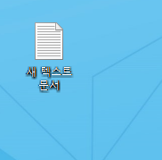

Git 이란?

분산 버전관리( 중앙 집중식 버전 관리와 다름)

중앙 집중식은 main 서버 터지면 다 날아감.

분산 버전관리는 버전에 대한 내용(수정된 정보)

만 분산해서 통신하면서 트래픽도 줄임.


git hub  는 만들언 놓은 버전들을 올려놓은 서버

(업로드 할 수 있는 가상 컴퓨터)


과제,평가,교제, pdf, ppt, 명세서, ssafy 각종문서(상장포함) 외부유출 금지

코드는 가능

git hub, star, profile


commit = version 업데이트

commit 한 번당 github에 초록네모 하나 생김.

commit이 많은날은 색이 점점 진해짐.

하는 업무에따라 계정을 나눠야 할 수도있음.

굳이 한계정에 다 올릴필요 없음.


깃랩, 깃헙 있음. 과제제출 등 활용할 것


마크다운 : 마크업 깔끔하게 해주는 프로그램.

마크업(태그를 써서 문서의 구조를 나타낸것)

문서의 구조와 내용을 같이 쉽고 빠르게 적고자 탄생

# 아니 -## = 대주제

## 아니 - ## 소주제

- - - - - - - - - , - 띄어쓰기는 동그라미 

실시간 마크다운 변환 제공, 이미지/표 삽입시 매우편한 UI제공

github의 READ.me (git 은 이걸 메인에서 가장 먼저 보게해줌)

- 개인프로젝트의 소개문서
- 매일 학습한 내용 정리
- 마크다운을 이용한 블로그 운영(비추)
- - 개발 문서의 시작과 끝이라고 할 수 있다.
- - - 한 학기 매주마다 관통프로젝트 
- - - 최종프로젝트는 배운 모든내용활용해서 일주일간 하는 프로젝트 (어려움)
- - - 매주 금요일 하는 프로젝트 이어붙이고, 어떻게 했는지 read.me 에 정리


# 마크다운 기본 (노션과는 조금 다르니 주의)

> `>`파이프라인 인용문이나 부연 설명들을 작성할때 사용한다.
>
> `#`하나는 대제목 heading1 이라는 의미이다. ##, ### ,####,~6  많음. ``cltr+숫자``  으로 조정가능
>
> ``cltr + /`` 로 원본보기 가능
>
> ---는 구분선이다.,___,*** 도있음. 
>
> 이스케이프 문자는 \ 
>
> 1옆에 `` (back tick)사이에 문자를 넣으면 코드블럭이 됨.
>
> ___
>
> ## 리스트
>
> ### 순서가 있는 리스트
>
> 1. 리스트가 만들어진다.
> 2. 엔터치면 자동으로 다음숫자 만듦 
>    1. tab으로 그 세부 사항도 만들수 있다.
>    2. *,+,-로 순서가 없는 리스트 가능 
>    3. (방식도 순서있는 리스트와 같음 중간에 순서 있는 겄도 섞을 수 있다.)
> 3. 엔터를 치면 자동으로 당겨지거나 지워짐
> 4.  shift + tab  은 다시 밖으로 나갈 수 있다.
> 5. 완전히 나가고자 한다면 가장 밖에있는 리스트에서 한번더 들여쓰기
>
> ## 코드와 관련된 기능
>
> ` 색 넣어주는 기능 아님`
>
> 문장을 쓰던 도중에,   print()라는 코드를 써야한다면, 코드의 가독성을 늘리기 위해 사용
>
> 문장을 쓰던 도중에,  `print()`라는 코드를 써야한다면, 코드의 가독성을 늘리기 위해 사용
>
> ##  코드 스니펫
>
> \```를 한번에 그 뒤에 쓰고자 하는 언어, 다른 채팅 창같은 곳에서도 똑같음.(ex. 텔레그램, 매터모스트)
>
> print("hello")
> 코드 공유할때 활용
>
> ```python
> print("hello")
> ```
>
> ## 텍스트관리
>
> 중요한 내용 -> ``cltr + b``  굵게 변경 가능
>
> \** 내용 \** 해도 글씨 굵어짐
>
> ~~취소선~~ -> ``~~``  물결표 표시 두개 사이에 넣으면 취소선
>
> ## 링크
>
> ``[링크 이름] (링크 url) ``
>
> [노출될 링크이름](https://www.naver.com)
>
> - 절대경로와 상대경로 온전한 전체주소:https://naver.com  www는 빠져도 됨.
> - https:// 가 빠지면 상대 경로가 된다. 내컴퓨터 상에서 찾게됨.
>
> ## 이미지
>
> 주의점: 반드시 .md 파일을 내가 관리하고자 하는 곳에 먼저 저장 (저장 위치 기반 이미지 업로드)
>
> 하지 않으면 다른 장소에서 이 파일을 열었을때 이미지가 안보임
>
> 
>
> 레포지토리에 올릴때  md 파일과 이미지 파일도 같이올려야  md 파일 열때 이미지가 보인다.
>
> ## 표 만들기
>
> ``cltr + t`` 하면 됨, 다른 방법도 있긴 하지만 번거로우니 이거 추천
>
> 

---

> # CLI (command line interface)
>
> - `cltr+l `화면을 깔끔히 clear가능 or clear 명령
>   - 명령창에 폴더/파일명 칠때  tab 활용하면 갈 수있는 경로 바로뜸 (자동완성)
>
> - ``touch`` 파일을 생성하는 명령어
> - ./  현재 작업중인 폴더, ../  상위폴더 
>
> ```bash
> $ touch 파일명
> ```
>
> - ``mkdir`` 새폴더를 생성하는 명령어
>
> ```bash
> $ mkdir 경로/폴더명
> ```
>
> - ``ls`` 현재 작업중인 디렉토리의 폴더/파일 목록을 보여주는 명령어
>
> ```bash
> $ ls -a #숨겨진 파일/폴더 탐색가능 , 바로 상위 폴더 ../ 상위 생략 . 
> $ ls -l #상세히 출력 ,소유자, 그룹, 기타 사용자들에 대한 권한
> $ ls /  #최상위 루트의 디렉토리 목록
> $ ls ./폴더명 #해당 폴더에 속한 내용물 보여줌
> ```
>
> - ``cd`` 현재 작업중인 디렉토리를 변경하는 명령어
>
> ```bash
> $ cd 경로/폴더명
> ```
>
> - `start, open` 폴더 파일을 여는 명령어. mac은 다름
>
> ```bash
> $ start 경로/파일명
> ```
>
> - `cp` 파일 혹은 디렉토리 복사
>
> ```bash
> $ cp testfile1 testfile_cp
> $ cp -r testdir testdir_cp
> ```
>
> - `rm` 파일이나 디렉토리 삭제
>
> ```bash
> $ rm -rf testdir/ #폴더는 r을 붙여줘야 하고 f는 바로삭제 , f=복구 불가
> $ rm -f testfile1
> ```
>
> - `cat` 파일 내용 출력 또는 파일 합치기. 작성 끝나면 `cltr + d`로 파일저장
>
> ```bash
> $ cat file1_2
> 1
> 2
> 
> $ cat file1 >> file2
> $ cat file2
> 2
> 1
> ```
>
> - find 특정 파일이나 디렉토리를 검색한다.
>   - find [검색경로] -name [파일명]
>
> ```bash
> $ find ./ -name "*.jpg"
> ./picture1.jpg
> ./picture2.jpg
> ./picture3.jpg
> ./picture4.jpg
> 
> $ find ./ -name "*.jpg" -exec rm {} \;
> $ find ./ -type d # 폴더
> $ find ./ -type f # 파일
> $ find ./ -type f | wc -l #탐색결과 카운트
> 
> #예를들어 10만개의 파일이 있는데,
> 
> 그 중에 확장자가 .txt인 파일만 찾아내고,
> 
> txt 파일 안에 있는 ‘hi’ 라는 문자열을 ‘hello’로 바꾸려면 다음과 같이 하면 된다.
> find ./ -name "*.txt" -exec sed -i 's/hi/hello/g' {} \;
> ```
>
> 
>
> - mv 파일명 폴더명 #파일을 이동한다.
> ```bash
> $ mv 파일명 폴더명
> ```
# 데일리 할 것

- 데일리 설문
  - 월, 분기설문

- 데일리 루틴 5시 할것

  1. 온라인 실습실(매일 하는 과제 - 온라인 제출) - 이게 그냥 나오는건 아니고, 찍어주면 변형쯤.

     - 과제 - 무조건 그날 17시 시작 ~ 18시까지 끝내기=마감

        (금욜까지 열어놓는 이유는 결석,조퇴자등 배려.)

     - 온라인 제출 (왠만하면 해설 x,  해줄 수도 있긴함.)

  2. 데일리 설문

  3. 그 날 복습

  4. 깃랩 (과제는 월,화,수,목만  금요일은 하루종일 코드만짬(프로젝트) )

     - pdf repository
     - 그 주 금요일까지 제출
     - 월HW는 -> 화요일 해설, 화 HW -> 화요일 해설
     - 수HW는 -> 목요일 해설, 목 HW -> 목요일 해설
     - 금HW X

  5. 시험

     - 과락 60점.
     - 전국평균 70점이 목표.
     - 100점이면 마일리지 줄지도 ??
     - 자기 할꺼하면서 시험공부
     - 사피 시험점수를 목표로하지말고 자기꺼나 잘하자
     - JAVA, VUE.js 빼고 전부 파이썬
     - 초반만  python 이고 web(html, css), 알고리즘(문제해결력) 과락만 하지말자
     - 시험 정답은 시키는대로만 적자
     - 서술형에 아는거 다쓰지말고 물어본것만 쓰기(안물어본거 적으면 틀림.)
       - (ex. legb scope 범위)


# Git

- repository : 특정 디렉토리를 버전 관리하는 저장소
- git init 명령어로 로컬 저장소를 생성
- . git 디렉토리에 버전 관리에 필요한 모든 것이 들어있음
- git status 로 상태 확인 가능
   폴더안의 변동사항들을 트래킹하지 않고 있다.
   추가 커밋은 없고, 트래킹 안한 파일이 있다.
   git add로 트래킹해라.
- Working Directory에서 변화를 Staging Area로 옮겨둠(안보임)
   이때 WD 에서 수정을 하면 WD와 SA의 차이가 발생함.
   이 변화를 SA에 다시 반영도 가능함.
   repository로 옮기고 난뒤가 최종버전임.
   SA에 변동사항을 모으고 모아서 Repository에 commit해야 함
   WD: 내가 작업하고 있는 실제 디렉토리 | untracked
   SA: 커밋으로 남기고 싶은 특정 버전으로 관리하고 싶은 파일이 있는곳 | staged = tracked git
   RP: 커밋들이 저장되는곳 | committed = tracked git
      WA -> SA = git add <- 세트를 만드는 것
      SA -> RP = git commit <-이게 버전을 남기는 것
   why? 굳이 SA를 거치는 이유.
   (신발 공장) - (사진대 위에 올리기) - (사진 찍기)
   SA안쓰면 디렉토리에서 관리하는거 한번에 다올려야함
   SA쓰면 관리하고싶은거만 골라서 버전관리 가능
- gid add로 지정한 폴더나 파일은 SA에 올라가고 이 상태 변화 체크는 git status로 확인가능
- 같은 버전에서 관리하고 싶으면 같이 add 해서 SA로 올리면 됨.
- 파일 여러개 git add 파일명 파일명 파일명  <- 나열가능
- commit 남길떄 보통 1. 뭐가 수정됨? 2. 내용물이 뭐임? 을 남겨야함
- git commit -m "During SC | python intro| HOW TO GIT?" 이런식으로 -m 메시지 커밋가능
- git config --global user.email "you@example.com"
  git config --global user.name "nickname"
   (git아 설정하는데 글로벌로 이메일을.)
- git log --oneline
   쓸데 없는 긴 내용 생략하고 원라인으로 로그보기
   이때 나타나는 head -> master는 뭘까?
   가장 앞줄에 번호는 고유번호이고 -m으로 보낸 메시지는 내가보는 이름.
   branch 마스터 줄기의 헤드가 modified~~다. sc2가 마스터 그 head는 ?
   두 번쨰 줄에 첫번째 칸부터 # edit 이 들어가 있다.
-  git add . WD 내 전부 추적함.
   On branch master = 현재 WD
   nothing to commit, working tree clean 현재 마스터브랜치 올릴게 없다.
- commit 은 .git 이라는 local repository에 저장되있음.
   push 를 통해서 원격 저장소로 밀어넣으면 다른데서도 사용가능.
- 처음 git branch name 은 master 이었다가 미국 black lives matter 운동등으로
   main으로 바꿈.
   SSAFY에서 배운내용 올릴것은  TIL (today I learned)
- git remote add origin https://github.com/KangDue/TIL.git
  (깃, 오리진은 뒤에 링크를 말한다. ㅇㅋ?)
- git remote -v
  (원격 저장소 정보 확인 가능)
- git push -u origin master
  (지금까지 commit 한것들 push 할껀데 origin 이라 했던곳에 마스터가 작업하것을 올릴거야) 
- bash 메모장 :wq 하면 나가짐 , vim 파일명 하면은 메모장
- git pull origin master 마스터가 한 것 전부 내려받기.
   애드 커밋 푸시해서 올리면 풀 해서 다운받기
- git commit -am '커밋메시지' #애드 커밋 통합하기입니다.
   **!!! 주의사항 클론해온 폴더의 코드가 동일한 폴더여야 pull 받아올 수 있음.**
# 타이포라